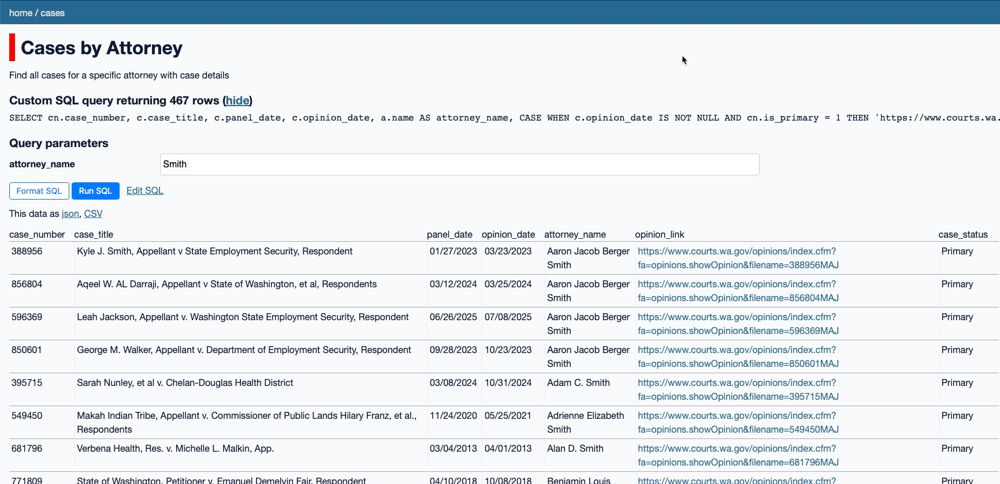

# Washington State Appellate Court Case Tracker

This is a tool that scrapes information about appellate court cases in Washington State and stores that data into a sqlite database. 

## Motivation
I once saw a news article referring to an appellate court opinion. I looked up the opinion, read it, and found it interesting and started reading more appellate opinions. I have been surprised at the number of times I've been involved in discussions that touch on issues of law and how little I and other laymen understand about how law works. The more I read opinions, the more I realize how misinformed I and others often are about legal issues we read about, have friends or families impacted by, or face ourselves. Familiarity with appellate court opinions can disabuse us of a lot of the nonsense that clutters our minds about the law.  

As I learned more about our court system in Washington, I became more curious about how long cases take to wind through the appellate court system and other aspects of appellate cases. Tracking that information across the various public websites is tedious so I decided to write some scripts to help me pull it all together. This project does that for me. For now, the code stores the data in a sqlite database. I use the open source datasette project to view the data.


## Quickstart
There is no quickstart. To scrape data across thousands of pages and pull it all into structured format into an SQL database takes a number of steps. Many of the steps are automated, but not all. To scrape pages, store them in your private db, and view queries against the data, these are the steps required: 

1. Clone the project
2. Install Chrome for Testing and the Selenium Chromedriver using the provided installer script.
3. Install the required dependencies for Chrome for Testing and Selenium Chromedriver.
4. Install the Python dependencies.
5. Run the two scraper scripts for date ranges. 
6. Run datasette against the database to view and query the scraped data.

## Supported Platforms
✅ macOS (arm64) — tested  
✅ Ubuntu/Debian Linux (x86_64) — tested  
✅ Windows via WSL 2 with an Ubuntu distribution — tested  
❌ Other platforms/architectures — not currently supported

> [!NOTE]
> For Windows users, run this project inside WSL 2 with Ubuntu. The instructions below for Ubuntu apply.

## Dependencies
This project uses:
- [Chrome for Testing](https://developer.chrome.com/docs/chrome-for-testing/) and the matching [Chromedriver](https://chromedriver.chromium.org/)
- [Selenium](https://pypi.org/project/selenium/)
- [SQLite](https://www.sqlite.org) (installed on most systems by default)
- [Datasette](https://datasette.io) (installed as part of running `pip install r requirements.txt`)

## Setup

### 1. Clone the project
```bash
git clone git@github.com:voylento/wa-opinions.git
```

### 2. Install Chrome for Testing and Chromedriver
Run the provided setup script, which will:
- Detect your platform
- Download the correct Chrome for Testing build
- Download the matching Chromedriver
- Place them into a `cft/` subdirectory

```bash
python3 setup_cft.py
```

### 3. Install required system packages (Linux/Ubuntu only)
On a minimal Ubuntu/Debian system, install these libraries first:

```bash
sudo apt update
sudo apt install -y curl unzip \
  libnss3 libx11-6 libx11-xcb1 libxcb1 libxcomposite1 libxcursor1 \
  libxdamage1 libxext6 libxi6 libxtst6 libxrandr2 libgbm1 \
  libatk1.0-0 libatk-bridge2.0-0 libcups2 libdrm2 libgtk-3-0 \
  libasound2t64
```

These packages provide all the runtime libraries Chrome needs, even in headless mode.

### 4. Install Python dependencies
Create and activate a virtual environment, then install requirements:

```bash
python3 -m venv venv
source venv/bin/activate
pip install -r requirements.txt
pip install -r requirements-dev.txt
```

### 5. Run the scraper
Running the scraper consists of two phases:

- Scrape the case consideration schedules for each year from 2012 to current
- Scrape the opinions release pages for each year 2013 to current

I recommend doing each on a year by year basis to build out the database, and at 
off-peak hours.

#### Scrape the consideration schedule:

> [!NOTE]
> The public pages for consideration schedule do not go back beyond 2012

From the project root:
```bash
source venv/bin/activate
./src/get_argument_dates.py --start 2012-01-01 --end 2012-12-31
```

Make iterative runs for each year up to the current year to fill out the database.

The scraper will log progress, warnings, and errors to the terminal as well as to
a log file under the log/ directory

The scraper will create a database named cases.db in the directory data/

#### Scrape the opinions schedule:

> [!NOTE]
> The public opinion release pages do not go back beyond 2013 (well, one case is shown for 2012)

```bash
source venv/bin/activate
./src/get_opinions.py --year 2013
./src/get/opinions.py --year 2014
```
etc.

### Run datasette on the database that was created

```bash
datasette data/cases.db -m data/metadata.json
```
Example View:


> [!NOTE]
> metadata.json contains 3 useful queries that get embedded into the datasette

Open a browser to http://localhost:127.0.0.1:8001 to explore the data in the browser

To connect to the database with the sqlite CLI:

```bash
sqlite3 data/cases.db
```

There are some sample SQL queries in [docs/sample_sql.md](docs/sample_sql.md)

## Future work
- The public websites being scraped do not have the panel dates for all cases. There are some additional ways to
scrape that data I plan to add.
- Links to a subset of data for older opinions is accessible through other url probing. 
- Add support to notate cases that were disposed of after consideration but before opinion release
- Add datasette-render-html support for the opinion links in the query results
- Add support for tagging cases

## Contributing
Fork the repro and submit pull requests. Talk to me first.

## License
MIT License.
